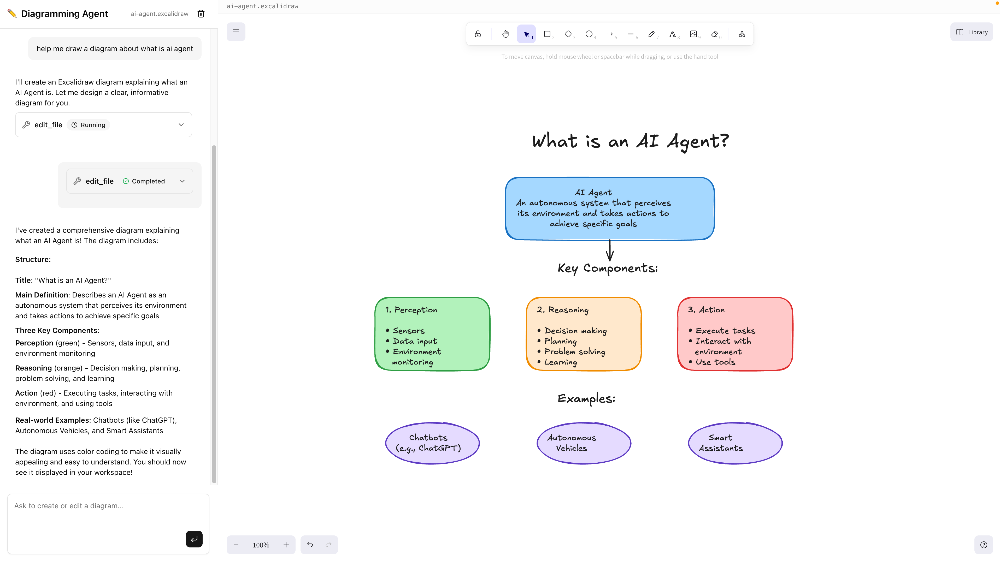

# Zypher Agent App Template: Diagramming Agent



AI diagramming agent with a split-panel UI: Zypher Agent chat on the left,
Excalidraw editor on the right. Built with
[Zypher Agent SDK](https://docs.corespeed.io/zypher).

- **Backend:** Deno + Hono with Zypher Agent (WebSocket + REST)
- **Frontend:** React + Vite + Tailwind CSS with streaming chat UI
- **Deployment:** Dockerfile with multi-stage build

## Project Structure

```
api/            Deno backend
  agent.ts        Agent configuration (model, tools, MCP servers)
  mod.ts          API router (mounts agent + custom routes)
web/            React frontend (pnpm)
  src/lib/zypher-ui/   Agent UI hooks (useAgent, TaskApiClient, etc.)
  src/components/      Chat UI components
main.ts         Hono server entry point
Dockerfile      Production build
```

## Getting Started

```sh
# Install frontend dependencies
cd web && pnpm install && cd ..

# Start backend
deno task dev

# Start frontend (in another terminal)
cd web && pnpm dev
```

The app runs at `http://localhost:8080`.

### How it works

The Hono server (`main.ts`) handles everything on a single port:

- **`/api/*`** routes to the backend API (`api/mod.ts`), which mounts the Zypher
  Agent at `/api/agent` and any custom routes you define.
- **All other requests** are proxied to the frontend.

In **development**, the server proxies non-API requests to the Vite dev server
(port 5173) for HMR. In **production**, it serves the pre-built static files
from `web/dist` instead.
